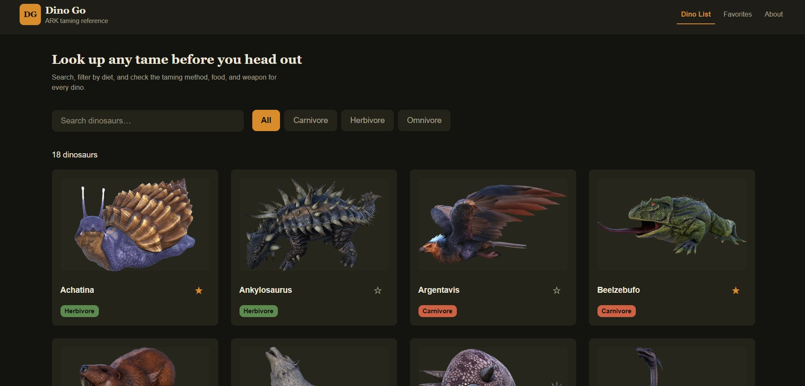
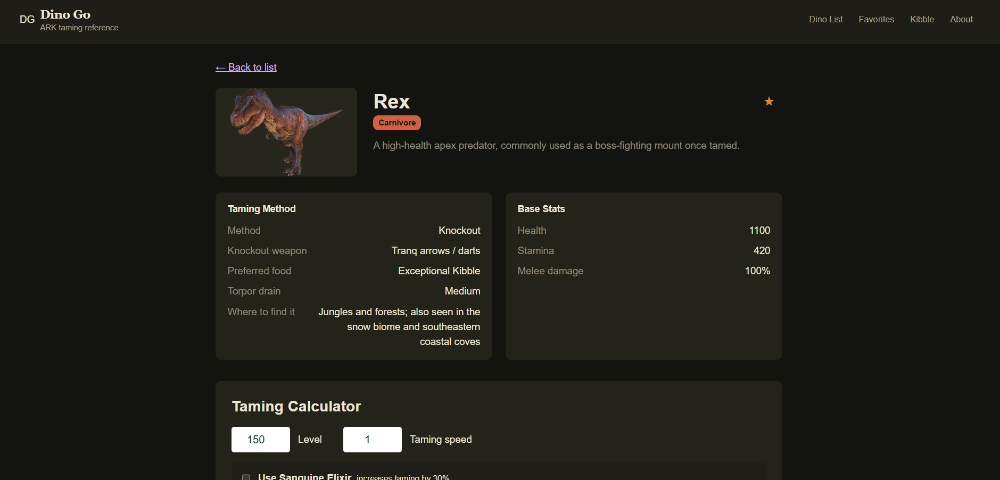
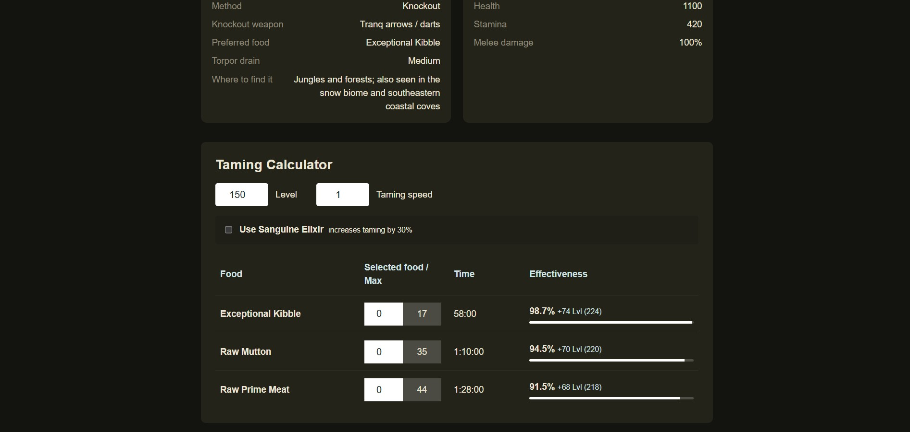
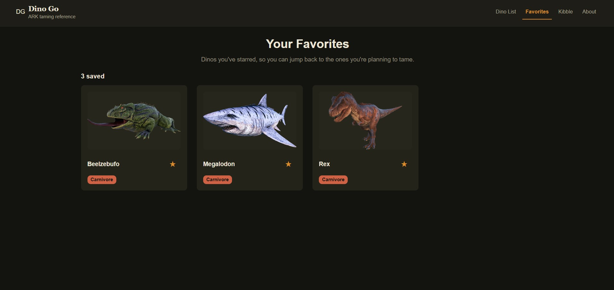
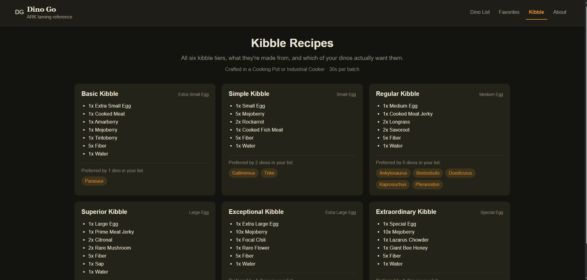
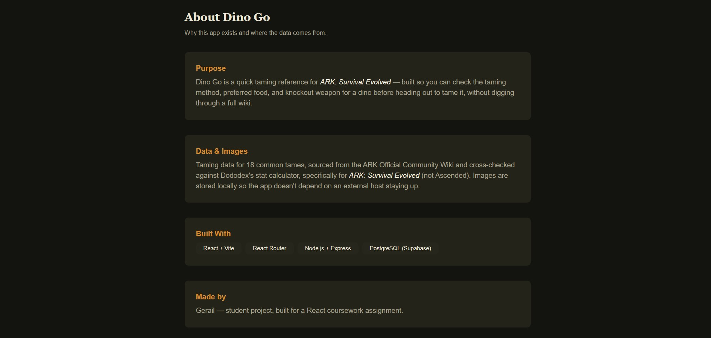

# Dino Go

A lightweight ARK: Survival Evolved taming reference app built with React, Express, and PostgreSQL.

**Live app:** [dino-go-fskt.vercel.app](https://dino-go-fskt.vercel.app/)



**API service:** [dino-go-production.up.railway.app](https://dino-go-production.up.railway.app/)

[](AI-USAGE.md)

> Built with AI assistance during backend setup, debugging, and data/calculation work. See [AI-USAGE.md](AI-USAGE.md) for the project notes.

## Overview

Dino Go helps players quickly find a dinosaur, check its taming method, preferred food, knockout requirements, spawn location, and a built-in taming effectiveness calculator before heading out to tame it.

The project is designed around a simple workflow:

1. Search or filter the dino list
2. Open a dino detail page
3. Review taming info and food efficiency
4. View Kibble Recipes
5. Save favorites for quick access later

## Tech stack

- Frontend: React + Vite
- Routing: React Router
- Backend: Node.js + Express
- Database: PostgreSQL via Supabase
- Hosting: Vercel (frontend) and Railway (API)

## Features

- Dino list with search and diet filters
- Dino detail view with taming information
- Favorite tracking in the database
- Taming effectiveness calculator
- Responsive UI for desktop and mobile

## Project structure

```text
Dino-Go/
├── client/                 # React frontend
│   ├── src/
│   ├── public/
│   ├── vercel.json
│   └── package.json
├── routes/                 # Express route handlers
├── db.js                   # PostgreSQL connection setup
├── server.js               # API server entry point
├── package.json
├── .env.example            # Placeholder environment variables
├── README.md
├── AI-USAGE.md
├── LICENSE
└── Screenshots/            # Project screenshots
```

## Prerequisites

- Node.js 22.12 or newer
- npm
- A Supabase project with PostgreSQL enabled
- Git

## Setup

### 1) Clone the repo

```bash
git clone https://github.com/Rex-The-Programmer/Dino-Go.git
cd Dino-Go
```

### 2) Install dependencies

Install the backend dependencies from the repository root:

```bash
npm install
```

Install the frontend dependencies:

```bash
cd client
npm install
cd ..
```

### 3) Configure environment variables

Copy `.env.example` to `.env` in the project root and fill in the real Supabase connection string locally. Keep `.env` private; it is ignored by Git.

```env
DATABASE_URL=postgresql://postgres.<project-ref>:<database-password>@aws-0-<region>.pooler.supabase.com:5432/postgres
PORT=3000
CLIENT_ORIGIN=http://localhost:5173
```

#### Production environment variables

The live frontend and API are hosted separately:

| Host | Variable | Value |
|---|---|---|
| Vercel | `VITE_API_URL` | `https://dino-go-production.up.railway.app/api` |
| Railway | `CLIENT_ORIGIN` | `https://dino-go-fskt.vercel.app` |
| Railway | `DATABASE_URL` | The Supabase session-pooler connection string, configured as a secret |

`VITE_API_URL` is embedded into the frontend during the build, so redeploy Vercel after changing it. Railway should start the Express server with `npm start`. The API only sends browser CORS headers for origins in `CLIENT_ORIGIN`; comma-separated exact origins are supported. CORS controls browser access but is not authentication or a replacement for Cloudflare Access.

For a same-origin local development setup, the Vite dev server proxies `/api` to `http://localhost:3000`. If `VITE_API_URL` is not set, the client also uses the relative `/api` path, suitable when Express serves both the built frontend and API.

Use Supabase's session pooler connection string and URL-encode special characters in its password if needed. Do not put credentials in frontend variables: Vite-prefixed variables are public in the built client.

### 4) Set up the database

Create the required database tables in Supabase/Postgres before running the app. At minimum, the backend expects a `dinos` table and a `favorites` table, and dino detail requests also read from `taming_foods`.

Example schema ideas:

```sql
CREATE TABLE dinos (
  id SERIAL PRIMARY KEY,
  name TEXT NOT NULL,
  diet TEXT,
  taming_method TEXT,
  knockout_weapon TEXT,
  spawn_location TEXT
);

CREATE TABLE favorites (
  id SERIAL PRIMARY KEY,
  dino_id INTEGER NOT NULL,
  UNIQUE (dino_id)
);

CREATE TABLE taming_foods (
  id SERIAL PRIMARY KEY,
  dino_id INTEGER NOT NULL,
  food_name TEXT NOT NULL,
  affinity NUMERIC NOT NULL,
  food_value NUMERIC NOT NULL,
  quantity INTEGER,
  sort_order INTEGER
);
```

## Running the app

Start the API from the repository root:

```bash
npm start
```

In a second terminal, start the Vite development server:

```bash
cd client
npm run dev
```

Open the app in the browser at:

```text
http://localhost:5173
```

Verify the backend is running at:

```text
http://localhost:3000/health
```

Expected response:

```json
{ "status": "ok" }
```

Build the production frontend:

```bash
npm run build
```

The root build script installs the client dependencies from `client/package-lock.json`, including Vite, and creates `client/dist`. Express serves that build, including client-side routes, when it is deployed together with the API. Railway's build command can be `npm run build`; its start command is `npm start`. Vercel deploys the `client/` project separately using its Vite build. Its `vercel.json` rewrite supports React Router page routes.

## Screenshots

The app preview and project artwork are stored in the repository's `Screenshots/` folder.

### Dino list


### Dino Detail Page


### Dino Taming Calculator


### Dino Favorite Page


### Kibble Recipe Page


### About me Page


## API overview

| Method | Route | Description |
|---|---|---|
| GET | `/health` | Health check |
| GET | `/api/dinos` | List dinos with optional search/filter parameters |
| GET | `/api/dinos/:id` | Get a single dino with taming details |
| GET | `/api/favorites` | List favorited dinos |
| POST | `/api/favorites/:dinoId` | Add a favorite (409 if already saved) |
| DELETE | `/api/favorites/:dinoId` | Remove a favorite (204 on success) |

## Deployment and security status

The frontend is publicly available on Vercel and its API is publicly reachable on Railway. Favorites are shared application data; there is no user login or per-user favorite ownership.

Cloudflare Access was selected as the intended access gate, but it is not configured or verified in this deployment. Putting Access only in front of the Vercel site would not protect the separately reachable Railway API URL. Before relying on Access, place the frontend and API behind a protected hostname and restrict direct access to the Railway origin, or choose an in-app authentication gate.

- `.env` is excluded by `.gitignore`; `.env.example` contains placeholders only. A database connection string was present in earlier Git history. Rotate the Supabase database password if that credential is still active; deleting the file from the current revision does not remove it from history.
- SQL queries use parameters for user-provided values, and API errors return generic client responses.
- The application has no debug, seed, or reset API routes.
- No project GitHub Actions workflows are configured.
- Keep personal contact details and student identifiers out of public files and commits.
- Keep the Cloudflare hostname, Access policy emails, and other private deployment notes outside this public repository.

## License

This project is licensed under the MIT License. See [LICENSE](LICENSE) for details.
