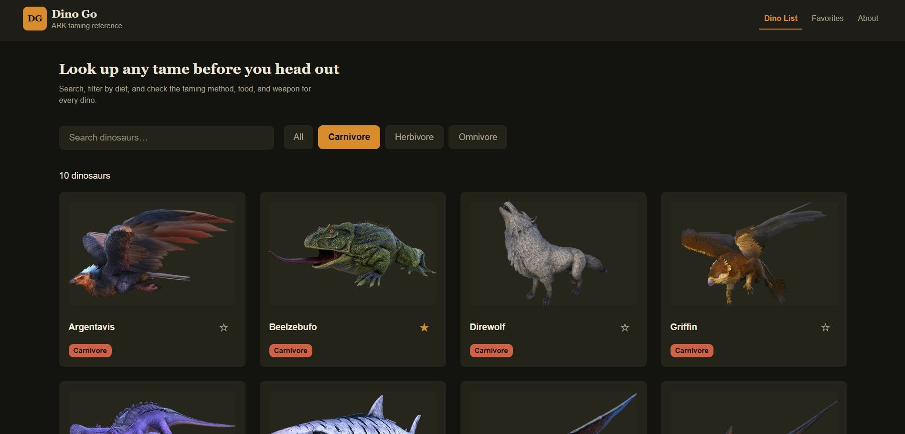
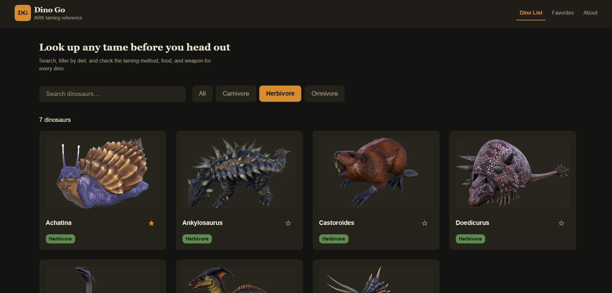
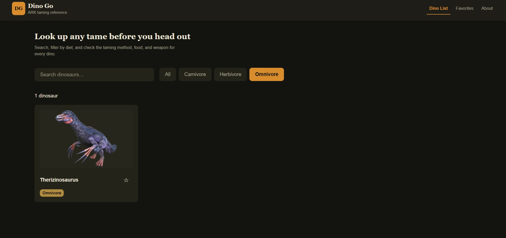

# Dino Go

A lightweight ARK: Survival Evolved taming reference app built with React, Express, and PostgreSQL.

[](AI-USAGE.md)

> Built with AI assistance during backend setup, debugging, and data/calculation work. See [AI-USAGE.md](AI-USAGE.md) for the project notes.

## Overview

Dino Go helps players quickly find a dinosaur, check its taming method, preferred food, knockout requirements, spawn location, and a built-in taming effectiveness calculator before heading out to tame it.

The project is designed around a simple workflow:

1. Search or filter the dino list
2. Open a dino detail page
3. Review taming info and food efficiency
4. Save favorites for quick access later

## Tech stack

- Frontend: React + Vite
- Routing: React Router
- Backend: Node.js + Express
- Database: PostgreSQL via Supabase

## Features

- Dino list with search and diet filters
- Dino detail view with taming information
- Favorite tracking in the database
- Taming effectiveness calculator
- Responsive UI for desktop and local use

## Project structure

```text
Dino-Go/
├── client/                 # React frontend
│   ├── src/
│   └── package.json
├── routes/                 # Express route handlers
├── db.js                   # PostgreSQL connection setup
├── server.js               # API server entry point
├── package.json
├── README.md
├── AI-USAGE.md
├── LICENSE
├── Screenshots/            # Local app screenshots
└── node_modules/
```

## Prerequisites

- Node.js 18+
- npm
- A Supabase project with PostgreSQL enabled
- Git

## Setup

### 1) Clone the repo

```bash
git clone https://github.com/Rex-The-Programmer/Dino-Go.git
cd Dino-Go
```

### 2) Install dependencies

Backend:

```bash
npm install
```

Frontend:

```bash
cd client
npm install
```

### 3) Configure environment variables

Copy `.env.example` to `.env` in the project root and fill in the real Supabase connection string locally:

```env
DATABASE_URL=postgresql://postgres.<project-ref>:<database-password>@aws-0-<region>.pooler.supabase.com:5432/postgres
PORT=3000
```

Notes:

- Use the Supabase session pooler connection string for the backend.
- URL-encode special characters in the password if needed.
- `.env` files are ignored by Git. Keep real credentials in local environment variables or your hosting provider's secret settings, never in source control.
- The frontend uses relative `/api` URLs. Vite proxies these requests to Express during local development; in production, Express serves the built frontend and API from the same origin.

### 4) Set up the database

Create the required database tables in Supabase/Postgres before running the app. At minimum, the backend expects a `dinos` table and a `favorites` table, and dino detail requests also read from `taming_foods`.

Example schema ideas:

```sql
CREATE TABLE dinos (
  id SERIAL PRIMARY KEY,
  name TEXT NOT NULL,
  diet TEXT,
  taming_method TEXT,
  knockout_weapon TEXT,
  spawn_location TEXT
);

CREATE TABLE favorites (
  id SERIAL PRIMARY KEY,
  dino_id INTEGER NOT NULL,
  UNIQUE (dino_id)
);

CREATE TABLE taming_foods (
  id SERIAL PRIMARY KEY,
  dino_id INTEGER NOT NULL,
  food_name TEXT NOT NULL,
  affinity NUMERIC NOT NULL,
  food_value NUMERIC NOT NULL,
  quantity INTEGER,
  sort_order INTEGER
);
```

## Running the app

Start the API in the project root:

```bash
npm start
```

For local frontend development, run Vite in a second terminal:

```bash
cd client
npm run dev
```

Open the app in the browser at:

```text
http://localhost:5173
```

Verify the backend is running at:

```text
http://localhost:3000/health
```

Expected response:

```json
{ "status": "ok" }
```

Build the production frontend with:

```bash
npm run build
```

The Express server serves `client/dist` when it exists, including client-side routes. For a single-origin production deployment, install dependencies in both the repository root and `client/`, run `npm run build`, and use `npm start` as the start command.

## Screenshots

The app screenshots are stored in the repository's `Screenshots/` folder.








## API overview

| Method | Route | Description |
|---|---|---|
| GET | `/health` | Health check |
| GET | `/api/dinos` | List dinos with optional search/filter parameters |
| GET | `/api/dinos/:id` | Get a single dino with taming details |
| GET | `/api/favorites` | List favorited dinos |
| POST | `/api/favorites/:dinoId` | Add a favorite |
| DELETE | `/api/favorites/:dinoId` | Remove a favorite |

## Known issues

The project is in active development and the README reflects the current state of the app. Some known issues may include incomplete data validation, optional placeholder values in certain taming calculations, and screenshot assets being stored in the repo root rather than a dedicated frontend assets folder.

## Public-release security checklist (draft)

- [ ] **Secrets:** Set `DATABASE_URL` only in local `.env` or the hosting provider's environment settings. `.env` is ignored; `.env.example` contains placeholders only. A historical `.env` commit was found, so rotate the Supabase database password before making the repository public. Removing the file from the latest commit does not remove it from Git history.
- [ ] **Cloudflare Access (Option A):** Put the production app on one hostname, such as `[APP_HOSTNAME]`, with Cloudflare proxying the DNS record. Create one self-hosted Access application for that hostname and an Allow policy using one-time PIN for the owner's email and the grader's email. Keep the actual hostname and email addresses in a private deployment checklist, not this public README.
- [ ] **Origin bypass:** Confirm the hosting provider's default hostname cannot be used to reach the app without Cloudflare Access (disable it or restrict it if supported). Cloudflare Access on the custom hostname does not protect a separately accessible host URL.
- [ ] **Access test:** In a private browser window, confirm the custom hostname requests a one-time PIN, and verify the allowed accounts can use the UI and favorites. Test that the host's default URL is unavailable or restricted.
- [ ] **Queries and errors:** User-provided query values use parameterized SQL, and API errors return generic messages without stack traces or database details.
- [ ] **Debug routes:** No debug, seed, or reset routes are present.
- [ ] **GitHub Actions:** No project workflows are currently present under `.github/workflows/`.
- [ ] **Personal information:** Keep the developer's name, personal email, and student number out of public files and commits. The seed data is game data.

## License

This project is licensed under the MIT License. See [LICENSE](LICENSE) for details.
